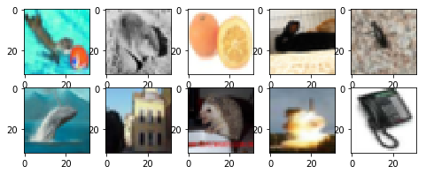

# CIFAR-100-Object-Recognition
Object classification on CIFAR-100 dataset using VGG-NET. [Validation Accuracy 70.48%]

## The CIFAR-100 dataset
This dataset is just like the CIFAR-10, except it has 100 classes containing 600 images each. There are 500 training images and 100 testing images per class. The 100 classes in the CIFAR-100 are grouped into 20 superclasses. Each image comes with a "fine" label (the class to which it belongs) and a "coarse" label (the superclass to which it belongs). 
The images and labels are all taken from the CIFAR-100 dataset which was collected by **Alex Krizhevsky, Vinod Nair, and Geoffrey Hinton**. The 100 object class labels are

| Superclass                         |Classes                                              |
|------------------------------------|-----------------------------------------------------|
| aquatic mammals                    |beaver, dolphin, otter, seal, whale
| fish                               |aquarium fish, flatfish, ray, shark, trout
| flowers                            |orchids, poppies, roses, sunflowers, tulips
| food containers                    |bottles, bowls, cans, cups, plates
| fruit and vegetables               |apples, mushrooms, oranges, pears, sweet peppers
| household electrical devices       |clock, computer keyboard, lamp, telephone, television
| household furniture                |bed, chair, couch, table, wardrobe
| insects                            |bee, beetle, butterfly, caterpillar, cockroach
| large carnivores                   |bear, leopard, lion, tiger, wolf
| large man-made outdoor things      |bridge, castle, house, road, skyscraper
| large natural outdoor scenes       |cloud, forest, mountain, plain, sea
| large omnivores and herbivores     |camel, cattle, chimpanzee, elephant, kangaroo
| medium-sized mammals               |fox, porcupine, possum, raccoon, skunk
| non-insect invertebrates           |crab, lobster, snail, spider, worm
| people                             |baby, boy, girl, man, woman
| reptiles                           |crocodile, dinosaur, lizard, snake, turtle
| small mammals                      |hamster, mouse, rabbit, shrew, squirrel
| trees                              |maple, oak, palm, pine, willow
| vehicles 1                         |bicycle, bus, motorcycle, pickup truck, train
| vehicles 2                         |lawn-mower, rocket, streetcar, tank, tractor

## Visualisation of original data with labels
These are some images from CIFAR-100 dataset.

## About VGG-NET
VGGNet is invented by VGG (Visual Geometry Group) from University of Oxford, Though VGGNet is the 1st runner-up, not the winner of the ILSVRC ImageNet Large Scale Visual Recognition Competition 2014 in the classification task, which has significantly improvement over ZFNet (The winner in 2013) [2] and AlexNet (The winner in 2012) [3]. And GoogLeNet is the winner of ILSVLC 2014, I will also talk about it later.) Nevertheless, VGGNet beats the GoogLeNet and won the localization task in ILSVRC 2014.

And it is the first year that there are deep learning models obtaining the error rate under 10%. The most important is that there are many other models built on top of VGGNet or based on the 3×3 conv idea of VGGNet for other purposes or other domains. That’s why we need to know about VGGNet! That is also why this is a 2015 ICLR paper with more than 14000 citations.

## Training score and accuracy
Training Score =  0.6011782038497925  
Training Accuracy =  0.99638 %

## Test score and accuracy
Validation Score =  2.111604061126709  
Validation Accuracy = 0.7048 %

## How To Run
Colne

Reference: Very Deep Convolutional Networks for Large-Scale Image Recognition
By:Karen Simonyan∗& Andrew Zisserman
+Visual Geometry Group, Department of Engineering Science,University of Oxford.

